# MyBudget — Cahier des Charges

**Product name:** MyBudget — Gestion des dépenses personnelles  
**Document type:** Official functional and technical specification  
**Status:** Approved baseline for development (documentation phase)  
**Audience:** Four-developer Flutter team  
**Stack:** Flutter, Dart, SQLite (`sqflite`), Riverpod, offline-first  

This document is the single source of truth for scope, data, architecture, ownership, and acceptance. Implementation starts only after the team validates it in Phase 0 of `DEVELOPMENT_PLAN.md`.

---

## 1. Context

MyBudget is a local mobile application that lets a person record income and expenses, organise them by category, set spending limits, and see the resulting financial situation on one screen.

The application runs entirely on the device. There is no server, no account system, and no synchronisation. A "user" is a local profile stored in SQLite.

The team has four developers. Each developer owns one database table and the complete feature built on that table: model, data access, repository, business rules, screens, state, errors, tests, documentation of that module, Git branch, and pull request.

---

## 2. Objectives

1. Let a person create and maintain a local profile, including the currency used to display amounts.
2. Let that person organise income and expenses into categories, including a predefined set and custom categories.
3. Let that person record, search, filter, sort, edit, and delete income and expense transactions.
4. Let that person define a spending limit per expense category for a month or a custom date range, and see how much of that limit is already used.
5. Present a dashboard and statistics computed from the four tables, with no extra table for aggregates.
6. Keep the database limited to exactly four tables: `users`, `categories`, `transactions`, `budgets`.
7. Produce an application that runs on Android without a network connection.

---

## 3. Scope

### 3.1 In scope

- Local profiles (create, read, update, delete, display).
- Currency selection stored on the profile.
- Category management, icons, and income/expense types.
- Transaction history with search, filters, and sorting.
- Category budgets and monthly or custom periods.
- Budget progress, remaining amount, percentage used, warning, and exceeded states.
- Dashboard and statistics derived at read time.
- Offline SQLite persistence with foreign keys enabled.
- Unit, integration, and UI tests for each owned module, plus cross-module scenarios.

### 3.2 Out of scope

The following are outside this version. They must not introduce a table, a backend, or a fifth feature owner.

- Remote authentication, passwords, sessions, and cloud sync.
- Notifications, reminders, and push messages.
- Multi-currency conversion and exchange rates.
- Savings goals, debts, and recurring payment schedules.
- Payment-method catalogues, receipts, and attachments.
- A dedicated settings, preferences, history, analytics, or statistics table.
- iOS release work, unless the team later expands the target. Android is the acceptance target.
- Collaborative or multi-device use.

Any extra behaviour required by the screens below is implemented with the four tables or with application logic (queries, providers, formatting).

---

## 4. Actors

| Actor | Description |
| --- | --- |
| Profile owner | The person using the phone. They select or create a local profile and then manage categories, transactions, and budgets for that profile. |
| Developer 1 | Owns the `users` module. |
| Developer 2 | Owns the `categories` module. |
| Developer 3 | Owns the `transactions` module. |
| Developer 4 | Owns the `budgets` module. |
| Whole team | Owns shared infrastructure (project bootstrap, database helper, theme, navigation shell, errors, utilities) and the later dashboard integration. |

There is one human role in the product. There is no administrator role and no login role.

---

## 5. Technology choices

| Concern | Choice | Role |
| --- | --- | --- |
| UI and application runtime | Flutter / Dart | Single codebase for the Android client. |
| Persistence | SQLite via `sqflite` | Offline database, opened on the device. |
| Paths | `path`, `path_provider` | Locate the database file in application storage. |
| State management | `flutter_riverpod` | Feature providers, dependency injection, test overrides. |
| Formatting | `intl` | Dates and currency display. |
| Tests | `flutter_test`, `integration_test` | Unit, widget, and flow tests shipped with the Flutter SDK. |

No HTTP client, no authentication SDK, and no remote database are part of this project.

### 5.1 Why Riverpod

Riverpod is the state-management solution for MyBudget.

- Each feature exposes its own providers (`userRepositoryProvider`, `categoryListProvider`, and so on). That matches the rule that one developer owns one module and keeps edits inside that feature folder.
- Repositories are injected through providers, so shared code does not depend on a global singleton that every branch would edit.
- Tests replace a repository with an override without touching production widgets.
- Provider is simpler, and it leaves module boundaries and test doubles less explicit for four people working at the same time.
- Bloc is a solid pattern, and it adds event/state boilerplate this offline CRUD application does not need.

Providers live in the presentation layer of each feature. They call domain rules and repositories. Widgets watch providers and do not open SQLite themselves.

---

## 6. Functional requirements

Identifiers use the form `FR-<area>-<number>`. Priority is Mandatory unless noted.

### 6.1 Profile (`users`) — Developer 1

| ID | Requirement |
| --- | --- |
| FR-USR-01 | The application starts on profile selection when at least one profile exists, and on profile creation when none exists. |
| FR-USR-02 | The owner can create a profile with name, email, and currency. |
| FR-USR-03 | Email is unique among profiles on the device. It identifies the profile. It is not used to sign in. |
| FR-USR-04 | The owner can display the active profile: name, email, currency, creation date. |
| FR-USR-05 | The owner can update name, email, and currency. |
| FR-USR-06 | The owner can delete the active profile. Deletion removes that profile's categories, transactions, and budgets. |
| FR-USR-07 | The owner can switch the active profile when several profiles exist. |
| FR-USR-08 | Currency is an ISO 4217 alphabetic code stored on the profile. The default proposed value is `TND`. The selectable set is `TND`, `EUR`, `USD`, `GBP`, `MAD`. |
| FR-USR-09 | Changing currency changes the label used to display amounts. Stored amounts stay as they were entered. The application does not convert history. |
| FR-USR-10 | Creating a profile asks the categories module to insert the predefined categories for that profile. |

Profile preferences that belong in this version are limited to the currency code on the user row. No other preference is stored.

### 6.2 Categories — Developer 2

| ID | Requirement |
| --- | --- |
| FR-CAT-01 | The owner can list categories of the active profile, separated or filtered by type (`EXPENSE`, `INCOME`). |
| FR-CAT-02 | The owner can create a custom category with name, type, and icon. |
| FR-CAT-03 | The owner can edit the name and icon of a category. Changing type is refused when the category is referenced by a transaction or a budget. |
| FR-CAT-04 | The owner can delete a category that is not referenced by any transaction or budget. |
| FR-CAT-05 | When a category is referenced, deletion is refused until the owner reassigns those transactions and budgets to another category of the same type, or deletes those records through their own modules. |
| FR-CAT-06 | The owner picks an icon from a fixed catalogue of Material icon keys stored as text. |
| FR-CAT-07 | A category belongs to one profile and has exactly one type. |
| FR-CAT-08 | Two categories of the same profile, same name (case-insensitive trim), and same type cannot coexist. |
| FR-CAT-09 | Predefined categories are ordinary rows inserted at profile creation. They follow the same edit and delete rules as custom categories. |
| FR-CAT-10 | Other modules select a category through a shared category picker provided by this module. The picker can be restricted by type. |

**Predefined categories inserted for every new profile**

| Name | Type | Icon key |
| --- | --- | --- |
| Food | EXPENSE | `restaurant` |
| Transport | EXPENSE | `directions_car` |
| Housing | EXPENSE | `home` |
| Health | EXPENSE | `medical_services` |
| Shopping | EXPENSE | `shopping_bag` |
| Leisure | EXPENSE | `movie` |
| Education | EXPENSE | `school` |
| Bills | EXPENSE | `receipt_long` |
| Other expense | EXPENSE | `category` |
| Salary | INCOME | `payments` |
| Freelance | INCOME | `work` |
| Gifts | INCOME | `card_giftcard` |
| Other income | INCOME | `savings` |

**Icon catalogue (stored value is the key)**

`restaurant`, `directions_car`, `home`, `medical_services`, `shopping_bag`, `movie`, `school`, `receipt_long`, `category`, `payments`, `work`, `card_giftcard`, `savings`, `pets`, `flight`, `fitness_center`, `child_care`, `phone_iphone`, `local_cafe`, `more_horiz`.

### 6.3 Transactions — Developer 3

| ID | Requirement |
| --- | --- |
| FR-TXN-01 | The owner can create an expense or an income for the active profile. |
| FR-TXN-02 | A transaction stores amount, type, category, date, and an optional description. |
| FR-TXN-03 | The selected category belongs to the active profile, and `category.type` equals `transaction.type`. |
| FR-TXN-04 | The owner can update every editable field of a transaction, still respecting FR-TXN-03. |
| FR-TXN-05 | The owner can delete a transaction. Deletion does not delete the category or the budget. Budget progress changes because it is recalculated. |
| FR-TXN-06 | The owner can view history for the active profile, newest transaction date first, then newest creation time. |
| FR-TXN-07 | The owner can search by description (case-insensitive substring). |
| FR-TXN-08 | The owner can filter by type, by category, and by an inclusive date range. Filters combine with AND. |
| FR-TXN-09 | The owner can sort by transaction date, amount, or category name, ascending or descending. The default sort is transaction date descending. |
| FR-TXN-10 | Amounts are strictly greater than zero. The type carries the direction (income or expense). Amounts are not stored as negative numbers. |

### 6.4 Budgets — Developer 4

| ID | Requirement |
| --- | --- |
| FR-BDG-01 | The owner can create a budget for one expense category of the active profile. |
| FR-BDG-02 | A budget has a positive limit, a period (`MONTHLY` or `CUSTOM`), a start date, and an end date. |
| FR-BDG-03 | For `MONTHLY`, the owner picks a calendar month. The application sets `start_date` to the first day of that month and `end_date` to the last day. |
| FR-BDG-04 | For `CUSTOM`, the owner picks both dates. `end_date` is on or after `start_date`. |
| FR-BDG-05 | The owner can update the limit, the period, and the dates. The category can change only to another expense category of the same profile, and only when the new interval does not overlap another budget of that category. |
| FR-BDG-06 | The owner can delete a budget. Transactions remain. |
| FR-BDG-07 | Two budgets of the same profile and the same category must not have overlapping inclusive date ranges. |
| FR-BDG-08 | Income categories cannot receive a budget. |
| FR-BDG-09 | The budget screen shows amount spent, remaining amount, percentage used, and a state: normal, warning, or exceeded. |
| FR-BDG-10 | Those figures are calculated from expense transactions. They are not columns in `budgets`. |

### 6.5 Dashboard and statistics — shared, Phase 5

The dashboard is a shared feature. It reads the four modules. It does not own a table and it is not a fifth developer assignment during parallel development.

| ID | Requirement |
| --- | --- |
| FR-DSH-01 | Show the active profile currency on every amount. |
| FR-DSH-02 | Show all-time balance: total income minus total expenses. |
| FR-DSH-03 | Show all-time total income and all-time total expenses. |
| FR-DSH-04 | Show income and expenses for the current calendar month. |
| FR-DSH-05 | Show remaining amount summed across budgets that cover today, and list budgets in warning or exceeded state. |
| FR-DSH-06 | Show the five most recent transactions. |
| FR-DSH-07 | Show a spending summary: expense totals grouped by category for the current month. |
| FR-DSH-08 | Statistics are computed when the screen is opened or when underlying data changes. Nothing is persisted for them. |

**Statistics views**

| ID | View | Rule |
| --- | --- | --- |
| FR-STA-01 | Expenses by category | Sum of `EXPENSE` amounts in the selected month, grouped by category. |
| FR-STA-02 | Monthly expenses | Sum of `EXPENSE` amounts per calendar month, for a trailing window of six months including the current month. |
| FR-STA-03 | Monthly income | Same window, `INCOME` only. |
| FR-STA-04 | Income versus expenses | For the selected month, both totals side by side. |
| FR-STA-05 | Most expensive category | The expense category with the highest sum in the selected month. Ties break by category name ascending. |
| FR-STA-06 | Spending evolution | The six monthly expense totals from FR-STA-02, in chronological order. |
| FR-STA-07 | Budget consumption | For each budget overlapping the selected month, percentage used as defined in section 12. |

---

## 7. Non-functional requirements

| ID | Requirement |
| --- | --- |
| NFR-01 | The application fulfils the functional requirements with the device in airplane mode after the first install. |
| NFR-02 | Acceptance is demonstrated on Android. |
| NFR-03 | The database file contains exactly the tables `users`, `categories`, `transactions`, and `budgets`. SQLite internal objects (`sqlite_sequence`, indexes) are allowed. No application table beyond those four is allowed. |
| NFR-04 | Foreign keys are enforced on every connection. |
| NFR-05 | Invalid input is rejected before a write, with a message the owner can read. |
| NFR-06 | A failed write leaves the previous rows unchanged. |
| NFR-07 | Amounts and dates use one shared formatting helper so every screen shows the same shapes. |
| NFR-08 | The visual language (colours, type, spacing, buttons, empty states, errors) comes from the shared theme. |
| NFR-09 | Each module is testable without the other modules' widgets, using an in-memory or test database and Riverpod overrides. |
| NFR-10 | Cross-module flows in section 16 of the development plan pass before the demonstration. |

---

## 8. Database design

The logical database name is `mybudget.db`. Schema version starts at `1`. Later changes increment the version and ship a migration reviewed by all four developers.

Dates and timestamps are stored as ISO-8601 text:

- Dates: `YYYY-MM-DD`
- Timestamps: `YYYY-MM-DDTHH:MM:SS` in local time, produced by one shared clock helper

SQLite types used: `INTEGER`, `REAL`, `TEXT`.

### 8.1 Relational overview

```text
users 1 ──── * categories
users 1 ──── * transactions
users 1 ──── * budgets
categories 1 ──── * transactions
categories 1 ──── * budgets
```

A transaction also stores `user_id` so lists and totals can be scoped without joining through categories. That `user_id` must be the same as the category's `user_id`. The database guarantees each foreign key on its own. The repository guarantees the two user references match.

Budget progress reads transactions. There is no foreign key from `budgets` to `transactions`.

### 8.2 Table `users`

Developer 1.

| Column | Type | Constraints |
| --- | --- | --- |
| `id` | INTEGER | Primary key, autoincrement |
| `name` | TEXT | NOT NULL, length 1–80 after trim |
| `email` | TEXT | NOT NULL, UNIQUE, stored lowercased, valid mailbox shape |
| `currency` | TEXT | NOT NULL, length 3, one of `TND`, `EUR`, `USD`, `GBP`, `MAD`, default `TND` |
| `created_at` | TEXT | NOT NULL |
| `updated_at` | TEXT | NOT NULL, set to `created_at` on insert, refreshed on every update |

`updated_at` supports profile modification. It is a column of `users`, not a history table.

### 8.3 Table `categories`

Developer 2.

| Column | Type | Constraints |
| --- | --- | --- |
| `id` | INTEGER | Primary key, autoincrement |
| `user_id` | INTEGER | NOT NULL, foreign key → `users(id)` ON DELETE CASCADE ON UPDATE CASCADE |
| `name` | TEXT | NOT NULL, length 1–40 after trim |
| `type` | TEXT | NOT NULL, CHECK in (`EXPENSE`, `INCOME`) |
| `icon` | TEXT | NOT NULL, one of the catalogue keys |
| `created_at` | TEXT | NOT NULL |

Uniqueness: unique index on `(user_id, name_normalized, type)` where `name_normalized` is the trimmed lowercased name. SQLite has no expression unique constraint that the team must rely on in every version, so the repository normalises the name before insert and the table also has:

```text
UNIQUE (user_id, name, type)
```

The repository stores the trimmed display name and rejects a second row whose trimmed lowercase name collides for the same user and type.

### 8.4 Table `transactions`

Developer 3.

| Column | Type | Constraints |
| --- | --- | --- |
| `id` | INTEGER | Primary key, autoincrement |
| `user_id` | INTEGER | NOT NULL, foreign key → `users(id)` ON DELETE CASCADE ON UPDATE CASCADE |
| `category_id` | INTEGER | NOT NULL, foreign key → `categories(id)` ON DELETE RESTRICT ON UPDATE CASCADE |
| `amount` | REAL | NOT NULL, CHECK `amount > 0` |
| `type` | TEXT | NOT NULL, CHECK in (`EXPENSE`, `INCOME`) |
| `description` | TEXT | NULL allowed, trimmed length 0–200, stored as NULL when empty |
| `transaction_date` | TEXT | NOT NULL, `YYYY-MM-DD` |
| `created_at` | TEXT | NOT NULL |

Indexes:

| Name | Columns | Purpose |
| --- | --- | --- |
| `idx_transactions_user_date` | `(user_id, transaction_date)` | History and month totals |
| `idx_transactions_category` | `(category_id)` | Category usage and budget sums |
| `idx_transactions_user_type` | `(user_id, type)` | Income and expense totals |

### 8.5 Table `budgets`

Developer 4.

| Column | Type | Constraints |
| --- | --- | --- |
| `id` | INTEGER | Primary key, autoincrement |
| `user_id` | INTEGER | NOT NULL, foreign key → `users(id)` ON DELETE CASCADE ON UPDATE CASCADE |
| `category_id` | INTEGER | NOT NULL, foreign key → `categories(id)` ON DELETE RESTRICT ON UPDATE CASCADE |
| `amount_limit` | REAL | NOT NULL, CHECK `amount_limit > 0` |
| `period` | TEXT | NOT NULL, CHECK in (`MONTHLY`, `CUSTOM`) |
| `start_date` | TEXT | NOT NULL, `YYYY-MM-DD` |
| `end_date` | TEXT | NOT NULL, `YYYY-MM-DD`, CHECK `end_date >= start_date` |
| `created_at` | TEXT | NOT NULL |

Index:

| Name | Columns | Purpose |
| --- | --- | --- |
| `idx_budgets_user_category` | `(user_id, category_id)` | Overlap checks and progress lists |

There is no column for spent, remaining, or percentage.

### 8.6 What is deliberately absent

These concepts stay out of the schema:

| Concept | Where it lives |
| --- | --- |
| Notifications | Not in this version |
| Statistics and analytics | Queries in the dashboard feature |
| Settings and preferences | `users.currency` only |
| Authentication | Not in this version |
| Currencies catalogue | Allowed codes validated in domain code |
| Goals | Not in this version |
| Payment methods | Not in this version |
| History / audit | `created_at` and `updated_at` on the row that changed |
| Predefined categories | Seeded rows in `categories` |

### 8.7 Deletion behaviour

| Action | Database behaviour | Application behaviour |
| --- | --- | --- |
| Delete user | `ON DELETE CASCADE` removes that user's categories, transactions, and budgets | Confirm with an explicit destructive prompt that names the profile |
| Delete category with no transaction and no budget | Row deleted | Allowed |
| Delete category that is referenced | `ON DELETE RESTRICT` makes the delete fail | The screen explains the block and offers reassignment to another category of the same profile and same type. Reassignment is an `UPDATE` of `transactions.category_id` and `budgets.category_id`. After reassignment, delete may proceed. |
| Delete transaction | Row deleted. Category and budget rows stay. | Budget and dashboard figures refresh from queries. |
| Delete budget | Row deleted. Transactions stay. | Dashboard budget summary refreshes. |

Cascade from user to categories happens in the database. Transactions and budgets also cascade from the user directly, so a user delete does not depend on category delete order. Category restrict still applies when the category is deleted on its own.

### 8.8 Update behaviour

| Action | Rule |
| --- | --- |
| Update user `id` | Not exposed. Primary keys are stable. `ON UPDATE CASCADE` exists so a future migration could change ids safely. |
| Update profile fields | `updated_at` changes. Currency change does not rewrite amounts. |
| Update category name or icon | Allowed when validation passes. |
| Update category type | Allowed only when no transaction and no budget references the category. |
| Update category `user_id` | Forbidden. A category does not move between profiles. |
| Update transaction | Allowed fields: amount, type, category, description, transaction date. `user_id` stays. Type and category type stay aligned. `created_at` stays. |
| Update budget | Allowed fields: category (expense, same user), limit, period, start, end. Overlap is rechecked. `created_at` stays. |

### 8.9 Validation rules

Validation runs in the domain layer before the repository writes. The database constraints are the last line of defence.

**User**

- Name: required after trim, 1–80 characters.
- Email: required, contains one `@`, a local part, and a domain with a dot. Stored lowercased and trimmed. Unique.
- Currency: one of the five codes.

**Category**

- Name: required after trim, 1–40 characters.
- Type: `EXPENSE` or `INCOME`.
- Icon: one of the catalogue keys.
- `user_id` refers to an existing profile.
- Uniqueness: no other category of that user and type has the same trimmed lowercase name.

**Transaction**

- Amount: finite number, strictly greater than 0. At most 3 decimal places when currency is `TND`, otherwise at most 2. Extra precision is rejected, not silently rounded at write time. Display uses the same scale.
- Type: `EXPENSE` or `INCOME`.
- Category exists, belongs to `user_id`, and has the same type.
- Date: valid calendar date, not empty. Future dates are allowed (a planned income or expense).
- Description: optional, at most 200 characters after trim.

**Budget**

- Category exists, belongs to `user_id`, and has type `EXPENSE`.
- Limit: finite, strictly greater than 0, same decimal scale as the profile currency.
- Period: `MONTHLY` or `CUSTOM`.
- Dates: valid, `end_date >= start_date`.
- `MONTHLY` spans exactly one calendar month (first day through last day).
- No overlap with another budget of the same user and category. Touching endpoints overlap: a budget ending on 31 March blocks another starting on 31 March for that category.

### 8.10 Entity-relationship diagram

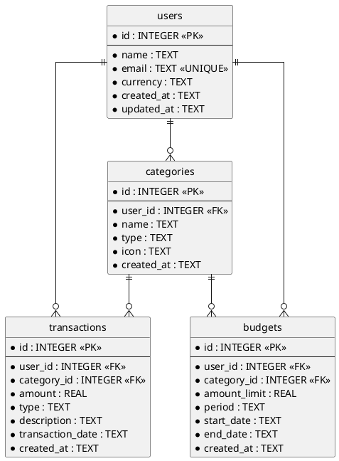

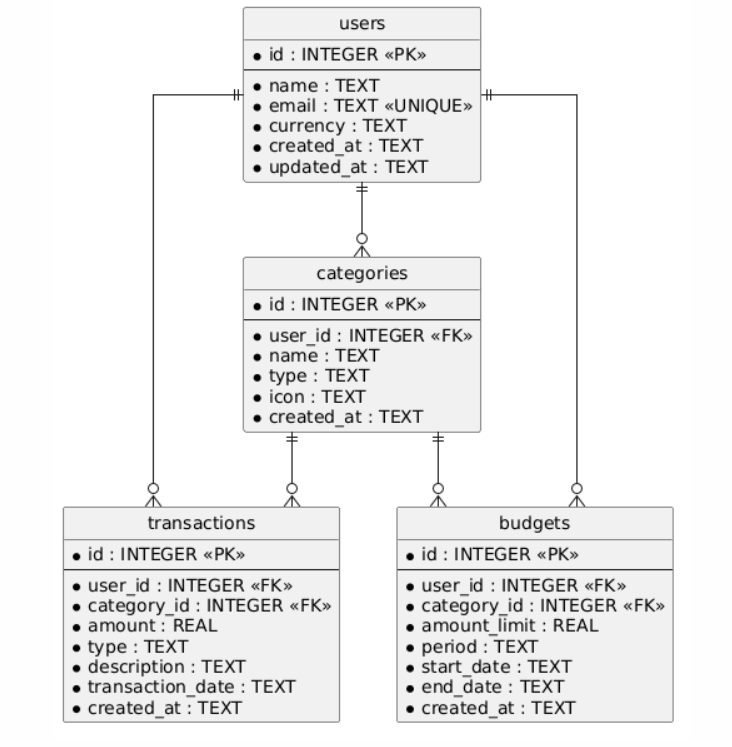

---

## 9. Architecture

The project follows a feature-first layout. Each feature is split into data, domain, and presentation. The split is a folder convention inside the feature, so Developer 1 through Developer 4 can work in parallel without a separate shared "domain" package that everyone edits.

### 9.1 Target tree

This tree is the contract for later implementation. It is not created in the documentation phase.

```text
lib/
├── core/
│   ├── database/
│   ├── constants/
│   ├── errors/
│   ├── utils/
│   └── theme/
├── features/
│   ├── users/
│   │   ├── data/
│   │   ├── domain/
│   │   └── presentation/
│   ├── categories/
│   │   ├── data/
│   │   ├── domain/
│   │   └── presentation/
│   ├── transactions/
│   │   ├── data/
│   │   ├── domain/
│   │   └── presentation/
│   ├── budgets/
│   │   ├── data/
│   │   ├── domain/
│   │   └── presentation/
│   └── dashboard/
│       ├── domain/
│       └── presentation/
├── shared/
│   ├── widgets/
│   └── models/
└── main.dart
```

`features/dashboard` is added in Phase 5. It has no `data/` folder and no table.

Tests mirror the feature folders under `test/` and `integration_test/`.

### 9.2 Layer responsibilities

| Layer | Responsibility | Must not |
| --- | --- | --- |
| `main.dart` | Start Flutter, wrap the tree in `ProviderScope`, open the app shell. | Contain business rules or SQL. |
| `core/database` | Open `mybudget.db`, set `PRAGMA foreign_keys = ON`, create the four tables, expose the current schema version, run migrations. | Contain feature validation or widgets. |
| `core/constants` | Currency codes, category type names, budget periods, warning threshold (80), icon catalogue keys, predefined category definitions. | Drift per feature into private copies of the same constants. |
| `core/errors` | Typed failures (validation, not found, conflict, restrict delete, database). | Show widgets. Mapping a failure to a message can live next to the type as a function. |
| `core/utils` | ISO date parsing, money scale by currency, month bounds, overlap test for date ranges. | Read widgets or hold feature state. |
| `core/theme` | Colours, text styles, input decoration, spacing, warning and exceeded colours. | Read the database. |
| `features/*/domain` | Models, validation, calculations that belong to that feature. | Import Flutter widgets or call `sqflite` directly. |
| `features/*/data` | Map rows to models, SQL for that table, repository implementation. | Build screens. |
| `features/*/presentation` | Screens, feature widgets, Riverpod providers. | Embed raw SQL. |
| `features/dashboard` | Compose read models from the four repositories and render dashboard and statistics screens. | Create a table or duplicate write logic. |
| `shared/widgets` | Empty state, error view, confirm dialog, amount text, loading indicator. | Encode a single feature's rules. |
| `shared/models` | Only types that truly cross features and are not owned entities (for example a paged list request). Prefer keeping `User`, `Category`, `Transaction`, and `Budget` inside their features and exporting them. | Become a fifth copy of the four entities. |

### 9.3 Dependency direction

```text
presentation → domain ← data
presentation → data (repository interface consumed via provider)
features/dashboard → public repositories of the four features
features/transactions → categories (picker and type check), users (active profile)
features/budgets → categories, users, transactions (read sums)
features/categories → users (active profile, seed on create)
core ← every feature
```

A feature does not import another feature's screens. It may depend on another feature's domain model and repository provider when the matrix in the development plan says so.

The active profile id is a Riverpod state owned by the users feature (`activeUserIdProvider`). Other features watch it. They do not store a second "current user" flag in SQLite.

### 9.4 Architecture diagram

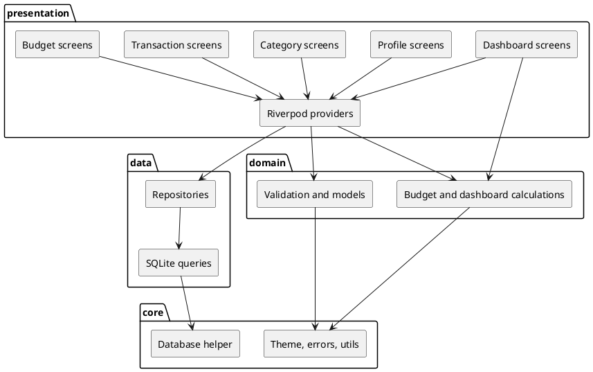

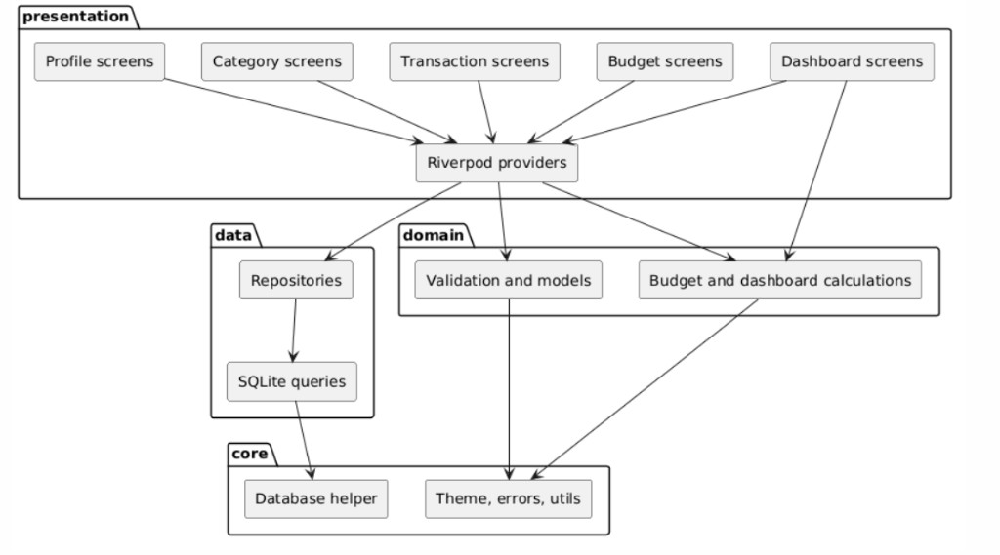

---

## 10. Shared work and developer ownership

### 10.1 Shared work

Shared work is done once, reviewed by all four developers, and merged before feature branches are cut. After that, shared files change only through a small chore pull request reviewed by the whole team.

| Shared component | Who drives the first version | How the others depend on it |
| --- | --- | --- |
| Flutter project creation | One driver during Phase 1, reviewed by all | Everyone builds on this project. |
| Dart and Flutter setup, analysis options | Same Phase 1 driver | Everyone uses the same SDK constraints. |
| Git repository branches `main` and `develop` | Same Phase 1 driver | Feature branches start from `develop` after Phase 2. |
| Folder structure under `lib/` and `test/` | Phase 1 driver | Each developer fills only their feature folder. |
| Dependency list (`flutter_riverpod`, `sqflite`, `path`, `path_provider`, `intl`) | Phase 1 driver | Nobody adds a dependency alone. |
| `core/database` helper, version, foreign keys, creation of the four empty tables | One driver during Phase 2, reviewed by all | Each repository receives the shared database instance. Nobody creates a second database file. |
| Migration strategy | Phase 2 driver | A later schema change is a team migration, not a private edit. |
| Theme | Phase 1 driver | Screens use theme values. |
| Navigation shell (destinations, no feature forms yet) | Phase 1 driver | Feature screens are registered by their owner into routes the shell already names. |
| Common errors and utilities | Phase 1 / Phase 2 driver | Validation and repositories return shared error types. |
| README and Git ignore | Phase 1 driver, expanded in Phase 8 | Onboarding for the team. |

The Phase 1 and Phase 2 driver is a rotating role for those phases only. It does not make that person the owner of every feature. Suggested driver for the written record: Developer 1 prepares the commits, and Developers 2, 3, and 4 review them before approval.

### 10.2 Developer-owned work

| Developer | Table | Owns |
| --- | --- | --- |
| 1 | `users` | Profile model, user repository, CRUD, validation, currency, active profile state, profile screens, seed invocation, user tests, `feature/users` |
| 2 | `categories` | Category model, repository, CRUD, icons, types, predefined seed function, delete and reassign rules, management screen, category picker, category tests, `feature/categories` |
| 3 | `transactions` | Transaction model, repository, CRUD, search, filter, sort, history and form screens, transaction tests, `feature/transactions` |
| 4 | `budgets` | Budget model, repository, CRUD, progress calculations, warning states, budget screens, budget tests, `feature/budgets` |

Dashboard and statistics are joint work on `feature/dashboard` after the four feature branches are on `develop`. That branch adds no table. Reviewers are all four developers. Developer 3 leads the income and expense aggregates. Developer 4 leads the budget summary. Developer 1 supplies currency and the active profile. Developer 2 supplies category names and icons.

### 10.3 Contracts between modules

These contracts are stable. Changing them requires a pull request reviewed by every affected owner.

| Contract | Provider | Consumer |
| --- | --- | --- |
| `activeUserIdProvider` | Users | Categories, transactions, budgets, dashboard |
| `seedDefaultCategories(userId)` | Categories | Users, called after a profile insert succeeds |
| Category picker limited by type | Categories | Transactions, budgets |
| `sumExpenses(userId, categoryId, start, end)` | Transactions | Budgets, dashboard |
| `listRecentTransactions(userId, limit)` | Transactions | Dashboard |
| Monthly income and expense totals | Transactions | Dashboard |
| Budget progress list for a date | Budgets | Dashboard |

---

## 11. Git workflow

### 11.1 Branches

```text
main
develop
feature/users
feature/categories
feature/transactions
feature/budgets
feature/dashboard          (created only in Phase 5)
chore/project-setup        (Phase 1)
chore/database-foundation  (Phase 2)
```

| Branch | Protection |
| --- | --- |
| `main` | No direct commits. Updated only by a pull request from `develop` when the demonstration checklist passes. |
| `develop` | Integration branch. Feature work lands here by pull request. |
| `feature/*` | One owner. Cut from `develop` after Phase 2 is merged. |
| `chore/*` | Shared foundation. Cut from `develop` at the start of Phase 1 and Phase 2. |

### 11.2 When to branch

- Phase 0 produces no feature branch.
- Phase 1 uses `chore/project-setup`.
- Phase 2 uses `chore/database-foundation`.
- Feature branches are created only after the database foundation pull request is on `develop`.
- A developer creates their feature branch once, and keeps it until that module's pull request merges.
- A second branch for the same module is justified only for a follow-up fix after merge (`fix/users-email-validation`), still owned by that developer.

### 11.3 Commits

Use short imperative subjects:

```text
feat(users): add profile validation
fix(categories): block delete when transactions exist
test(budgets): cover overlap rejection
docs(readme): describe local setup
chore(database): enable foreign keys
```

One commit is one logical step. Generated noise and local IDE files stay out of commits.

### 11.4 Pull requests

- Target `develop`, except the final promotion of `develop` into `main`.
- The description lists the requirements covered, the test commands run, and any contract touched.
- At least one other developer reviews. When the change touches a contract, the consuming owner reviews as well.
- The author does not merge their own pull request.
- Merge method: merge commit, so each module stays visible in history.
- A pull request is merged when review is approved and the module tests in that pull request pass.

### 11.5 Synchronisation and conflicts

- At least once a day, each feature branch merges `develop` into itself.
- Shared files (`lib/core/**`, `pubspec.yaml`, navigation shell) are frozen after Phase 2. A needed change is a `chore/` pull request, not a quiet edit inside a feature branch.
- Each developer writes files only under their feature directory and their test directory. The dashboard branch is the exception, and it starts after the four modules have merged.
- If two branches edit the same shared file, stop and move that edit onto one chore pull request.
- Schema changes are forbidden on feature branches. They go through a migration pull request reviewed by all four developers, then everyone merges `develop` again.

### 11.6 Order of integration

Development is parallel after Phase 2. Merging into `develop` follows dependency order so each pull request is testable:

```text
users → categories → transactions → budgets → dashboard
```

A later module may still be coded against the published contracts before its dependency is merged, using the agreed provider names. It merges only after its dependencies are on `develop`.

### 11.7 Integration testing before merge

Before a feature pull request merges, the author runs that module's unit tests and the database tests that touch their table. Before `develop` is promoted to `main`, the team runs the full unit, integration, UI, and cross-module suites on `develop`.

---

## 12. Calculation rules

Calculations are pure functions in domain code. They are not stored.

Let `expenses(user, category, start, end)` be the sum of `transactions.amount` where:

- `user_id` equals the profile
- `category_id` equals the budget category
- `type` equals `EXPENSE`
- `transaction_date` is between `start` and `end` inclusive

Income rows never reduce or increase a budget.

### 12.1 Budget progress

```text
spent = expenses(user, category, budget.start_date, budget.end_date)
remaining = budget.amount_limit - spent
percentage_used = spent / budget.amount_limit * 100
```

| State | Condition |
| --- | --- |
| Normal | `percentage_used` < 80 |
| Warning | `percentage_used` >= 80 and `percentage_used` <= 100 |
| Exceeded | `percentage_used` > 100 |

`remaining` may be negative when the budget is exceeded. The UI shows that negative remaining as overspend.

Division by zero cannot happen because `amount_limit` is strictly greater than zero.

### 12.2 Dashboard figures

All figures are for the active profile.

```text
total_income = sum of INCOME amounts
total_expenses = sum of EXPENSE amounts
balance = total_income - total_expenses

month_start, month_end = first and last day of the current month
monthly_income = sum of INCOME amounts with transaction_date in that month
monthly_expenses = sum of EXPENSE amounts with transaction_date in that month
```

Remaining budget on the dashboard is the sum of `remaining` for every budget whose date range contains today. Budgets that do not cover today stay off that particular total and remain visible on the budgets screen.

Recent transactions are the five rows with the latest `transaction_date`, then latest `created_at`.

Category spending for the summary is `monthly_expenses` grouped by `category_id`.

### 12.3 Money display

| Currency | Decimal places |
| --- | --- |
| TND | 3 |
| EUR, USD, GBP, MAD | 2 |

Display rounds half away from zero to that scale. Stored values already respect the scale because validation rejects extra digits.

---

## 13. Screens and navigation

| Screen | Owner | Purpose |
| --- | --- | --- |
| Profile gate | Dev 1 | Create the first profile or pick an existing one |
| Profile | Dev 1 | Show and edit the active profile, switch profile, delete profile |
| Categories | Dev 2 | List, create, edit, delete, reassign |
| Category form | Dev 2 | Name, type, icon |
| Transactions | Dev 3 | History, search, filters, sort |
| Transaction form | Dev 3 | Create or edit income or expense |
| Budgets | Dev 4 | List with progress states |
| Budget form | Dev 4 | Category, limit, period, dates |
| Dashboard | Shared | Balances, warnings, recent activity, spending summary |
| Statistics | Shared | The seven statistics views, with a month selector |

Primary navigation after a profile is active:

```text
Dashboard | Transactions | Budgets | More
```

`More` opens Categories and Profile. Statistics opens from the dashboard.

Empty states:

- No profile: profile gate only.
- No transactions: history explains how to add the first one. Dashboard totals are zero.
- No budgets: budget list invites creation. Dashboard remaining budget is shown as "no active budget".

### 13.1 Navigation diagram

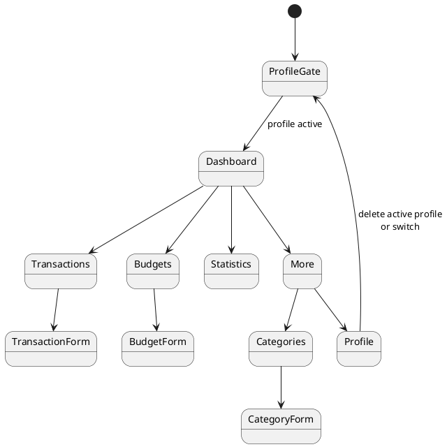

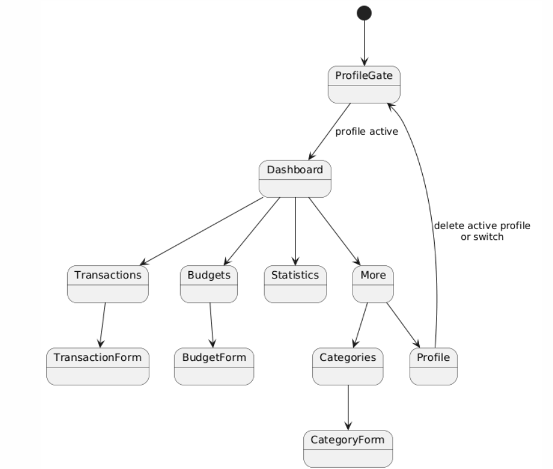

---

## 14. Use-case diagram

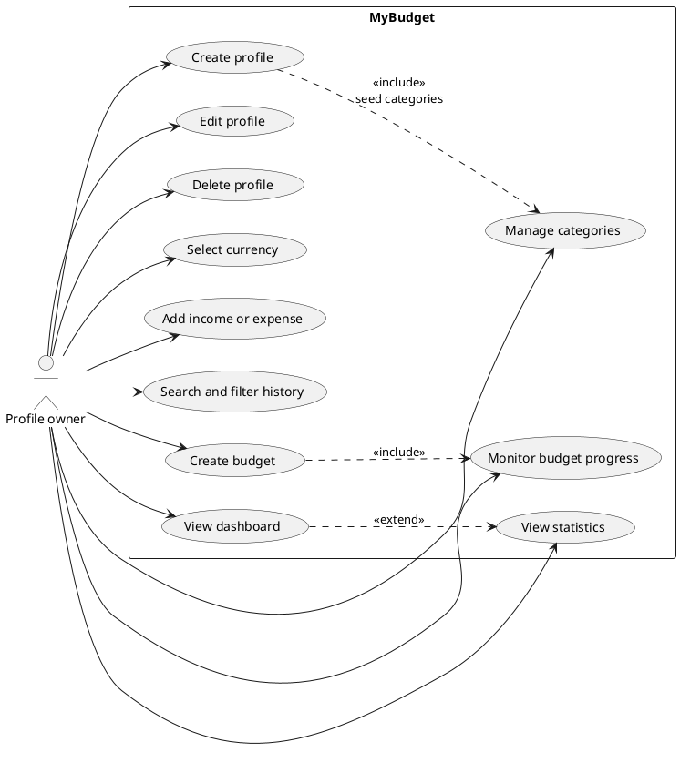

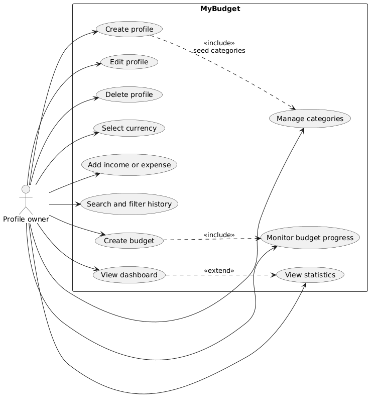

---

## 15. Class diagram

The diagram shows the domain types and the services the team will implement. It is a design view, not source code.

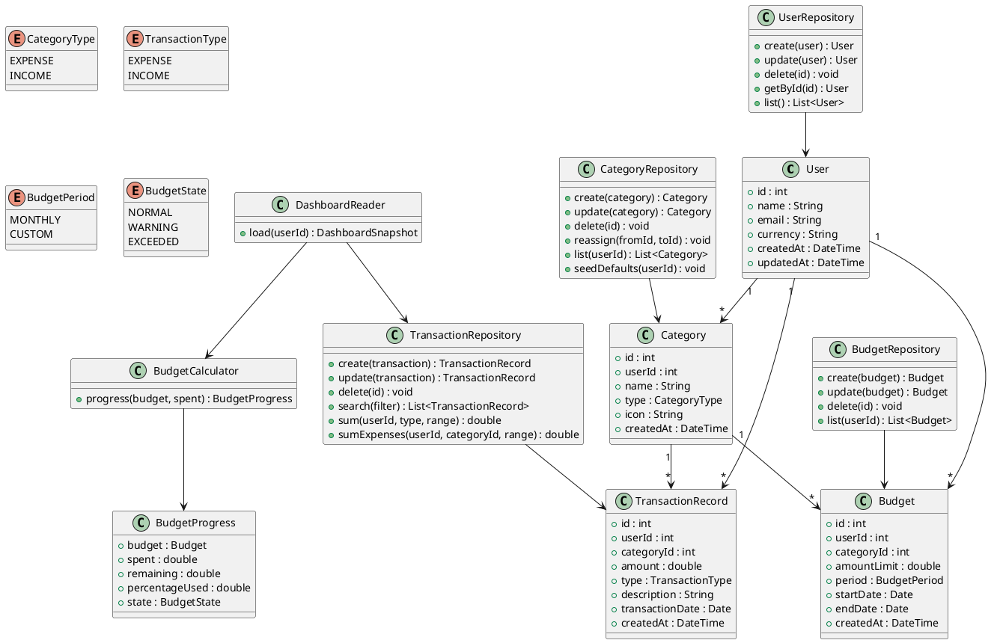

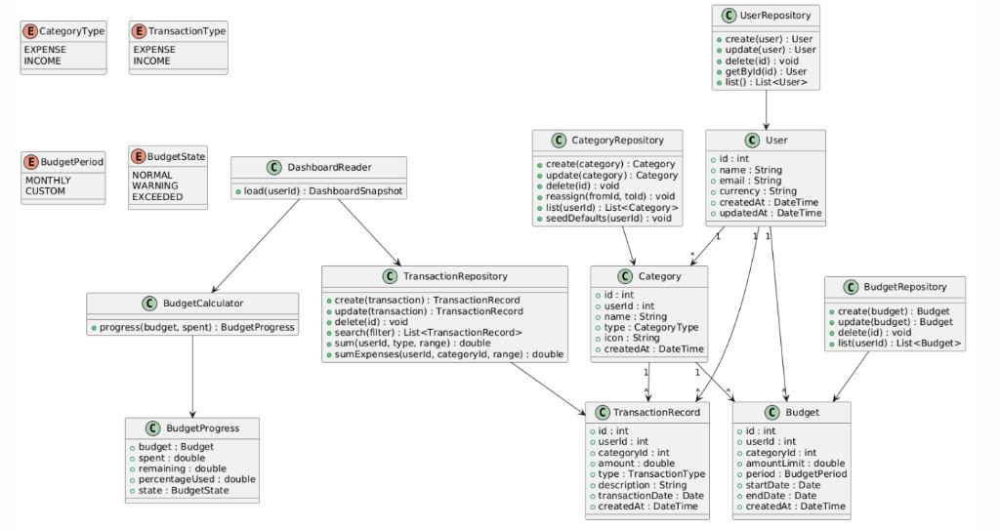

`TransactionRecord` is the design name of the transaction entity, so the class is not confused with a database transaction.

---

## 16. Sequence diagram — adding a transaction

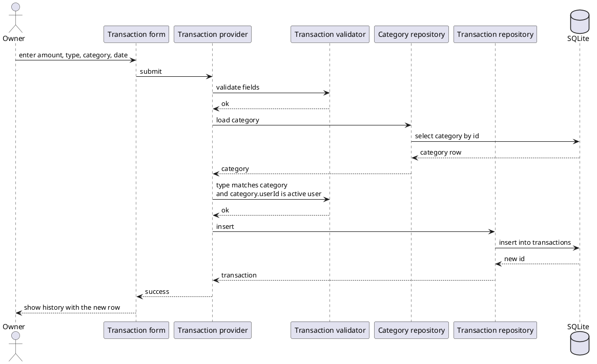

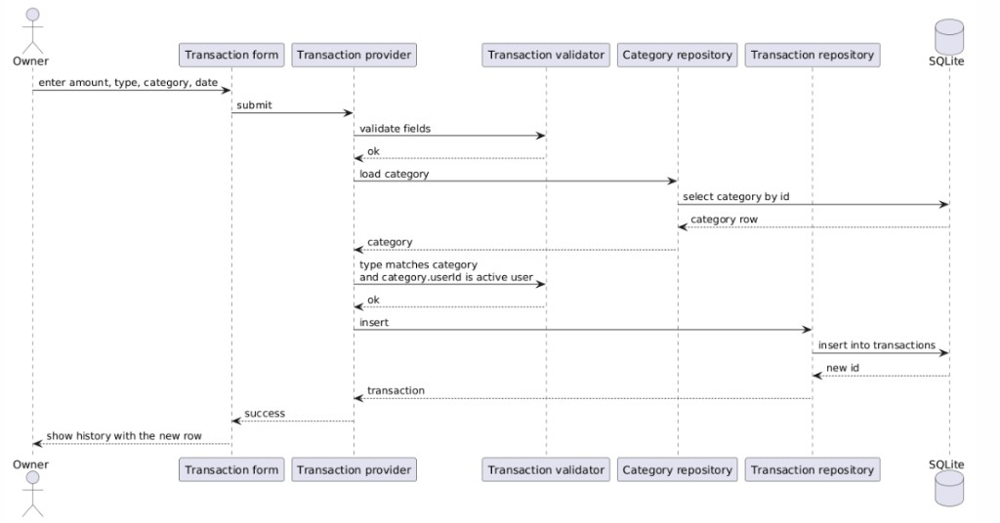

On validation failure, the provider returns a field error and SQLite is not called. On a foreign-key failure, the provider surfaces a shared database error and the form stays open with the entered values.

---

## 17. Sequence diagram — creating a budget

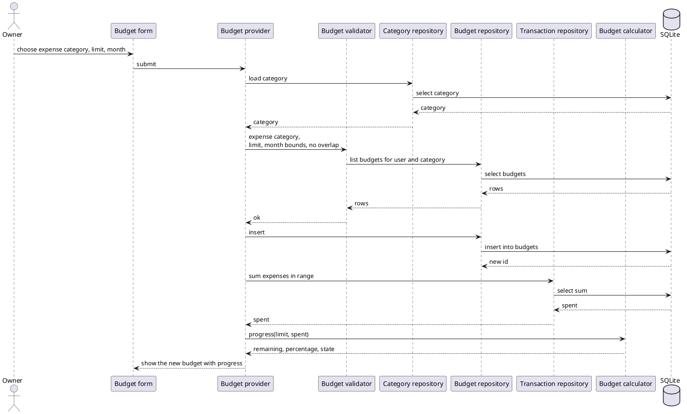

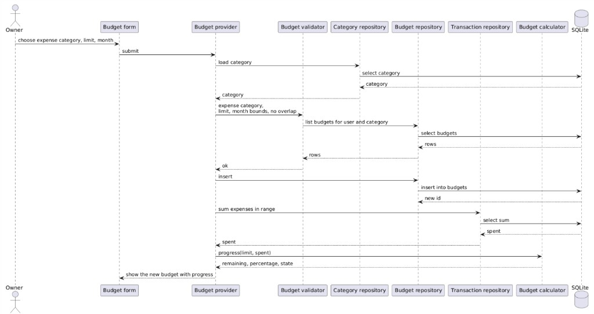

Overlap rejection returns a conflict error and does not insert. The spent sum is read after insert so the first paint is already correct. The sum is not written back into `budgets`.

---

## 18. Error handling

| Situation | Type | What the owner sees |
| --- | --- | --- |
| Empty or out-of-range field | Validation | The field message, form remains |
| Duplicate email or duplicate category name | Conflict | A specific duplicate message |
| Missing row | Not found | The list refreshes and a short notice explains that the item is gone |
| Delete category still in use | Restrict | Explanation plus reassignment |
| Overlapping budget | Conflict | The dates or category must change |
| SQLite error | Database | A generic failure message, values kept on the form, no partial feature-level state |

Repositories do not show dialogs. Providers map errors. Widgets render them.

---

## 19. Testing requirements in the specification

Detailed steps live in `DEVELOPMENT_PLAN.md`. The specification requires:

- Unit tests for models, validation, budget math, and dashboard math.
- Repository tests against a temporary database for CRUD and foreign keys on all four tables.
- Widget tests for each form's validation and for the main navigation destinations.
- One cross-module scenario that creates a profile, uses a category, records income and expenses, creates a budget, and checks progress and the dashboard.
- A schema test that fails if the application database contains any table other than `users`, `categories`, `transactions`, and `budgets`.

---

## 20. Acceptance criteria

The product is complete when every line below is true.

1. The application launches on Android and the demo scenario can be executed with the network disabled.
2. SQLite persists data across a full restart of the application.
3. The application database contains exactly four application tables: `users`, `categories`, `transactions`, `budgets`.
4. Each table supports the create, read, update, and delete operations defined for it, including the restrict and cascade rules.
5. A profile can be created, edited, displayed, switched, and deleted, with currency stored on the profile.
6. Predefined and custom categories can be created, edited, and deleted, and a referenced category cannot disappear silently.
7. Income and expense transactions can be created, edited, deleted, searched, filtered, and sorted.
8. A budget can be created, edited, and deleted for an expense category and a period.
9. Remaining amount and percentage used match the formulas in section 12 for a known set of expenses.
10. Warning and exceeded states follow the 80% and 100% thresholds.
11. Dashboard balance, monthly totals, recent transactions, and statistics match the same source rows.
12. After the statistics screen has been used, the database still contains exactly the four application tables.
13. Each module has unit tests and repository tests, and the cross-module scenario passes.
14. No crash occurs during the demonstration scenario.
15. Git history shows `feature/users`, `feature/categories`, `feature/transactions`, and `feature/budgets` merged through pull requests into `develop`, and `main` contains only that integrated result.
16. Each developer's commits are identifiable on their feature branch and module.

---

## 21. Document control

| Item | Rule |
| --- | --- |
| Changes to this specification | A pull request reviewed by all four developers before the related code changes. |
| Schema changes | Version increment and a migration described in the same pull request. |
| Companion document | `DEVELOPMENT_PLAN.md` is the execution roadmap. If the two documents disagree, this cahier des charges wins on product behaviour, and the development plan wins on phase order. |
