# MyBudget screen mockups

Phone screens for the specification in the cahier des charges. They illustrate the interface. They do not change the requirements.

Theme: calm green finance palette. Canvas `#F4F7F4`, primary `#1F6B4A`, income green, expense clay, warning amber, exceeded red. Amounts are in TND. The sample profile is Amira Ben Salah.

## Profile gate

Create a profile or continue with an existing one.

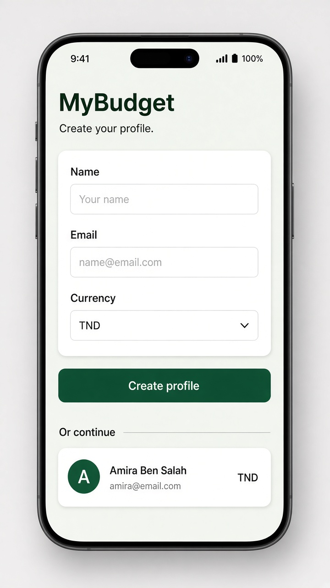

## Dashboard

Balance, monthly income and expenses, budget warning, spending summary, and recent transactions.

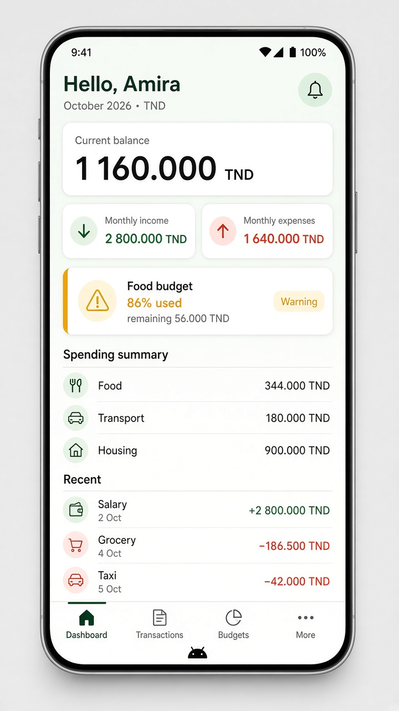

## Transactions

History with search, filters, and sort.

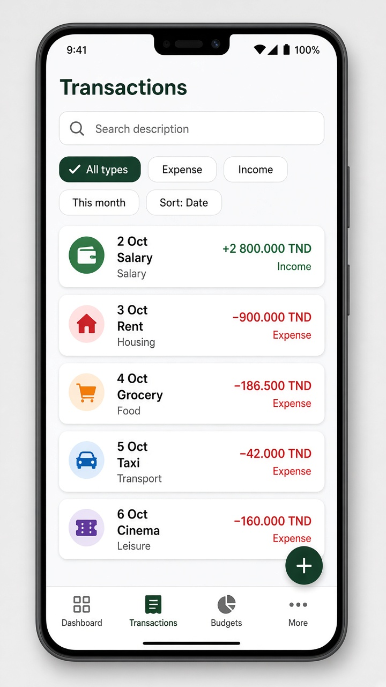

## Transaction form

Create an expense with amount, category, date, and an optional description.

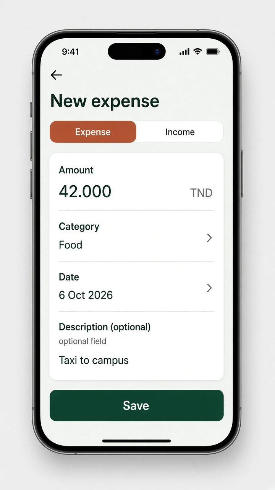

## Budgets

Category limits with normal, warning, and exceeded states.

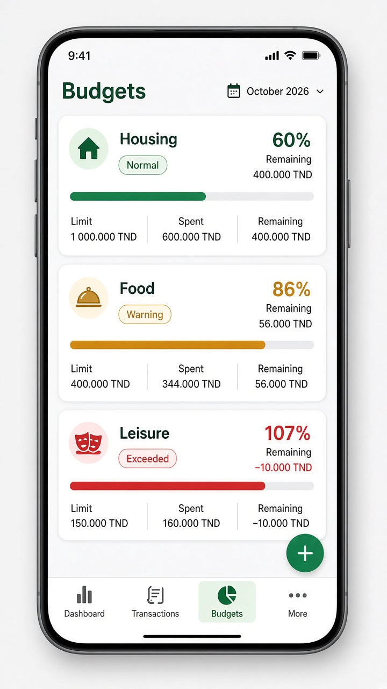

## Budget form

Assign an expense category, a limit, and a monthly period.

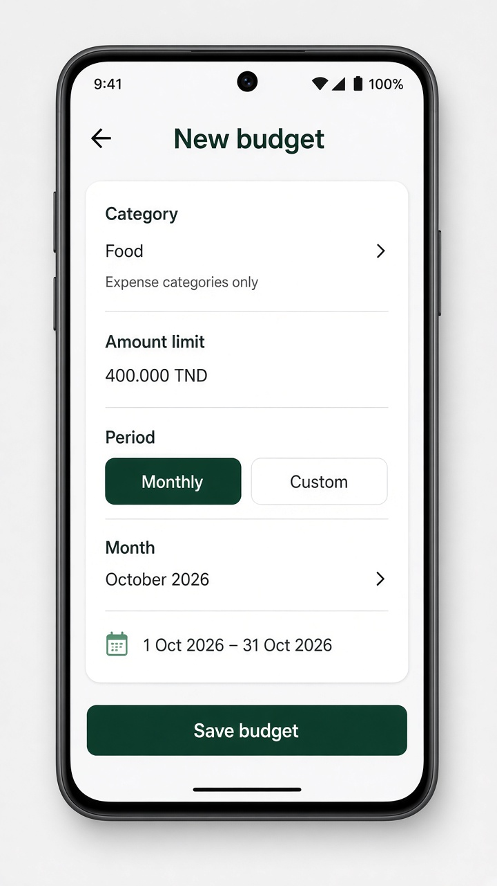

## Statistics

October view: income versus expenses, category totals, spending evolution, and budget consumption.

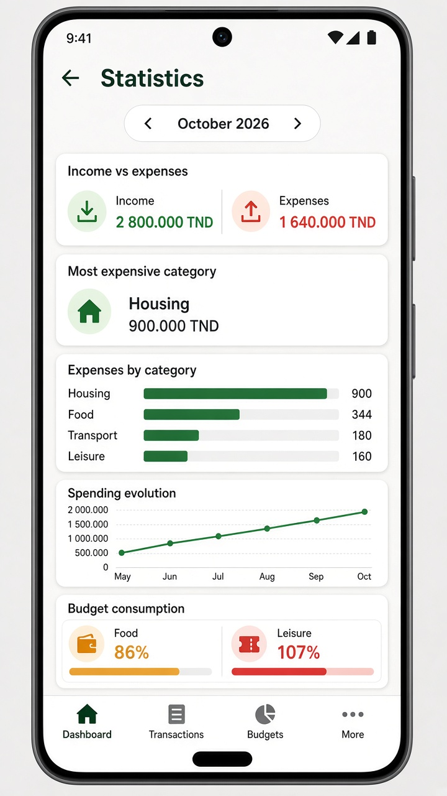

## More

Opens Categories and Profile.

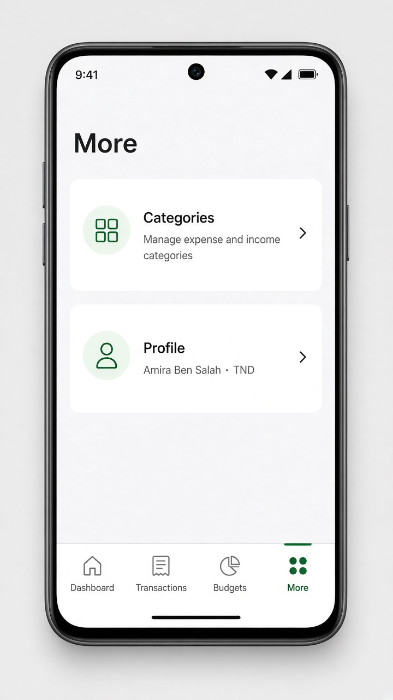

## Categories

Expense categories, including the custom Campus category.

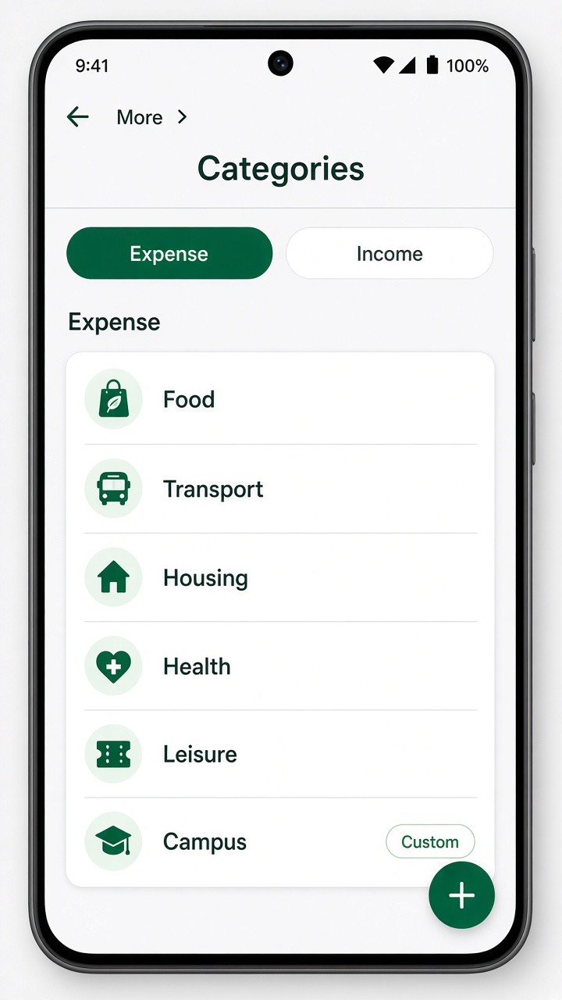

## Category form

Name, type, and icon.

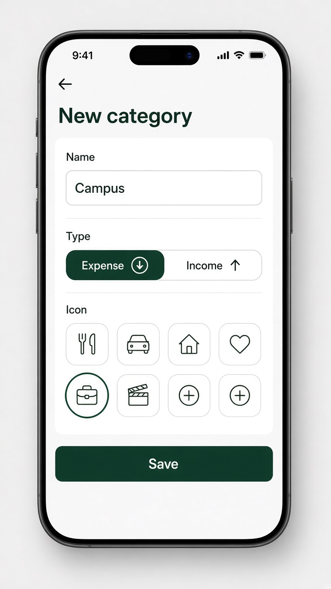

## Profile

Name, email, currency, creation date, and actions to edit, switch, or delete.

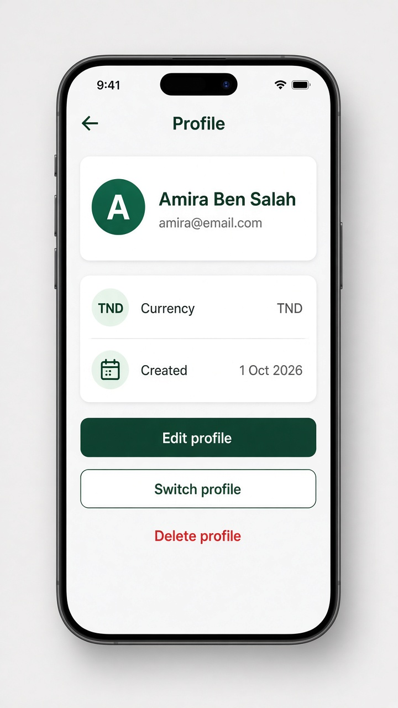
